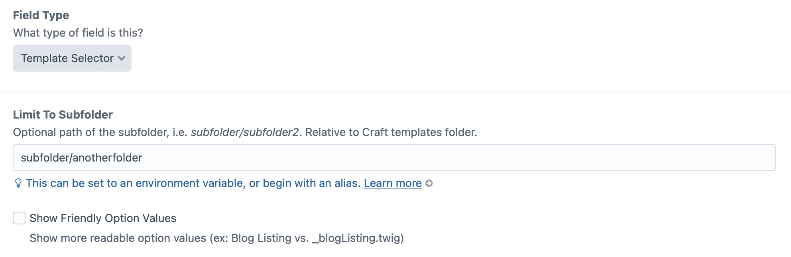
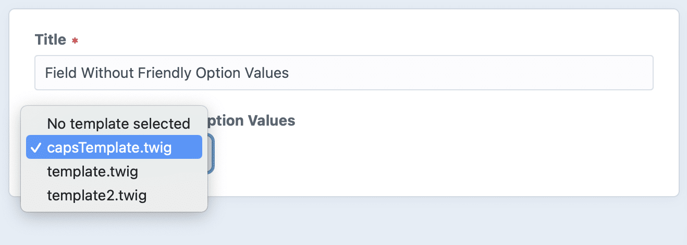
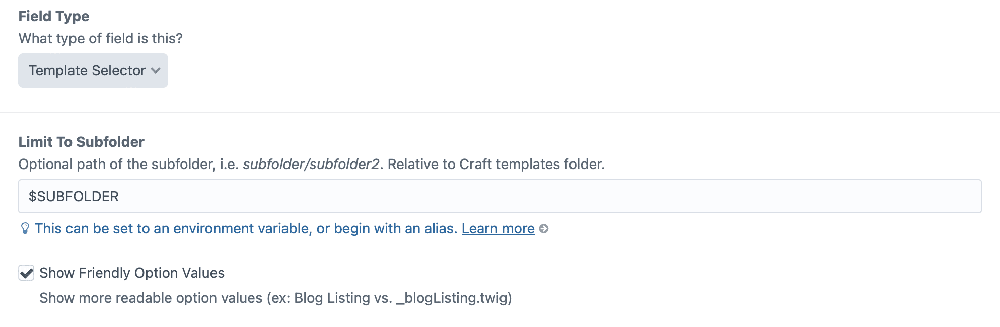
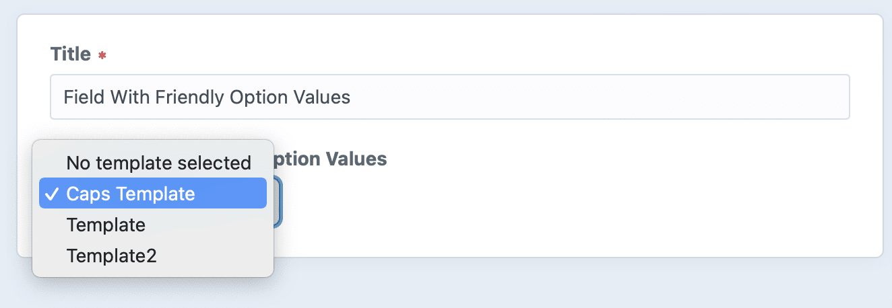

# Template Selector plugin for Craft CMS 3.x/4.x

A fieldtype that allows you to select a template from a dropdown.


## Requirements

This plugin requires Craft CMS 3.0.0-beta.23 or later, or Craft CMS ^4.0.0-alpha.1 or later.

## Installation

To install the plugin, select and install the plugin from the Craft Plugin Store, or follow these instructions:

1. Open your terminal and go to your Craft project:

        cd /path/to/project

2. Then tell Composer to load the plugin:

        composer require helloswish/template-selector

3. In the Control Panel, go to Settings → Plugins and click the “Install” button for Template Selector.

## Configuring Template Selector

Create a new field and choose field type Template Selector. 

In the field settings, you can limit the list of available templates to a subfolder of the Craft templates folder. The path is relative, i.e. _subfolder/subfolder2_. This may also be set to an ENV variable.





In the field settings, you can choose to make the template names more user friendly. In the field, file extensions will be removed, and the file names properly capitalized and spaced for readability.





## Using Template Selector

Output the chosen template name:

```twig
{{ entry.fieldHandle }}
```

Include/Embed the chosen template:

```twig
 or 
```

Output the subfolder name:

```twig
{{ craft.templateSelector.subfolder('fieldHandle') }}
```

Include/Embed more dynamically:

```twig

```

## More Info

Brought to you by [Swish Digital](https://swishdigital.co)

This is an updated and enhanced version of the [Template Select](https://github.com/sjelfull/craft3-templateselect) plugin by [Superbig](https://superbig.co)
